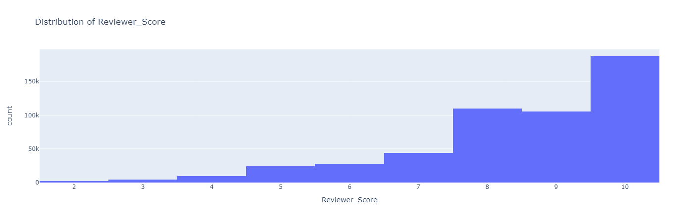
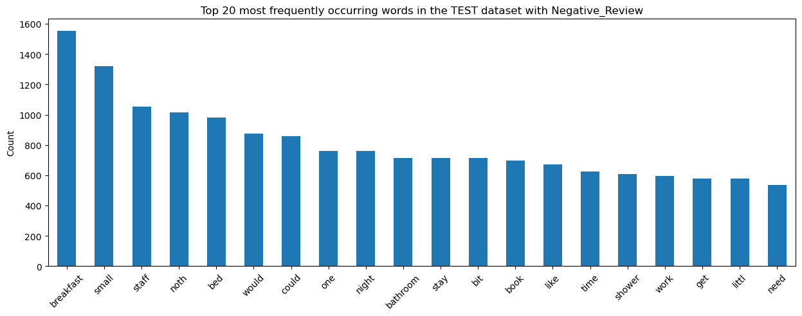
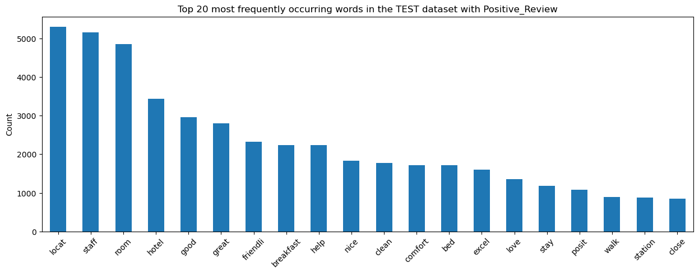

# Natural Language Processing with Hotel Reviews on Booking.com

## INTRODUCTION
NLP techniques can be used to automatically classify reviews as positive, negative, or neutral, or to extract specific topics or themes mentioned in the reviews. In the context of hotel reviews on Booking.com, NLP can be useful for hotel owners and managers to understand what guests like or dislike about their property and to identify areas for improvement. 

The project was separated into 2 parts. In part 1, a detailed Exploratory Data Analysis (EDA) was applied to understand more about the dataset. Then, the dataset would be converted to binary for ML classifiers in part 2. In addition, NLP was also applied to understand more about the reviews. In part 2, multiple ML classifiers were used to check the accuracy of the review. Lastly, there would be a brief discussion on the pros and cons of each classifier. 

Dataset: https://www.kaggle.com/datasets/jiashenliu/515k-hotel-reviews-data-in-europe

## EDA

The csv file contains 17 columns and 515,738 rows. The description of each column is below:

* Hotel_Address: Address of hotel.
* AdditionalNumberof_Scoring: There are also some guests who just made a scoring on the service rather than a review. This number indicates how many valid scores 
* Review_Date: Date when reviewer posted the corresponding review.
* Average_Score: Average Score of the hotel, calculated based on the latest comment in the last year.
* Hotel_Name: Name of Hotel
* Reviewer_Nationality: Nationality of Reviewer
* Negative_Review: Negative Review the reviewer gave to the hotel. If the reviewer does not give the negative review, then it should be: 'No Negative'
* ReviewTotalNegativeWordCounts: Total number of words in the negative review.
* Positive_Review: Positive Review the reviewer gave to the hotel. If the reviewer does not give the negative review, then it should be: 'No Positive'
* ReviewTotalPositiveWordCounts: Total number of words in the positive review.
* Reviewer_Score: Score the reviewer has given to the hotel, based on his/her experience
* TotalNumberofReviewsReviewerHasGiven: Number of Reviews the reviewers has given in the past.
* TotalNumberof_Reviews: Total number of valid reviews the hotel has.
* Tags: Tags reviewer gave the hotel.
* dayssincereview: Duration between the review date and scrape date.
* without review in there.
* lat: Latitude of the hotel
* lng: Longitude of the hotel

### Distribution of `Reviewer_Score`

The mean `Reviewer_Score` is 8.45. However, the distribution of the Reviewer_Score showed a left-skew toward 10. The studies on the classification of datasets assume a relatively normal distribution. However, class imbalance in the skewed dataset is quite common in real-world applications; thus, applying machine learning models from skewed datasets results in BIASED Classification towards the majority class which results in the misclassification of the minority class.



### Data Cleaning

There were less than 0.1% of duplicated rows and there was no duplicated column. It was safe to drop the duplicated rows without affecting the modelling.

There were 3,268 rows of `lat` and `lng` which were latitude and longitude were empty. The library `geopy.geocoders` were used to generate the missing `lat` and `lng` based on the address and zip code of the hotel for each entry.

There were over 1,000 blank spaces in `Reviewer_Nationality`, `Negative_Review`, and `Positive_Review`. This was a design error. A suggestion for Booking.com was to convert `Reviewer_Nationality` into a drop-down menu and a minimum of 300 characters is required to submit a review. 

## Data Wrangling

All non-numeric columns were converted to numeric with either `LabelEncoding` or `MultiLabelBinarizer`. This conversion created over 1000 new features/columns.

The results of NLP for negative and positive reviews are below:





The train set was separated into the train and validation sets. This was to prevent data leakage into the test set. Feature decomposition methods such as PCA were used to cut down the processing time for ML models and reduce overfitting (due to multi-collinearity). 

For both KNN and DecisionTree Classifiers, fine-tuning K-value was important to find the highest accuracy score for both the train and test sets with the best fitting. For multi-models, cross-5-validation and ML pipelines could be used to automatically fine-tune the parameters.

We applied machine learning models such as Linear, KNN & DecisionTree Classifiers to the target column of interest: `Reviewer_Score`. 
The accuracy score of the classifiers models are below:

|  | Logistic | KNN (k =35) | DecisionTree (max_depth=4) |
| :-: | :-: | :-: |:-: |
| Train Accuracy (%) | 88.58 | 68.00 | 76.63 |
| Test Accuracy (%)| 73.40 | 67.56 | 74.64 |

## Conclusion

The NLP on the hotel reviews on Booking.com in Europe showed that the average reviews were 8.45 with most reviews being over 8. 

In the negative reviews, users mentioned `small room`, `little`, `breakfast`, and ` one night`. 

In the positive reviews, users mentioned `location`, `staff`, `friendliness`, `help`, `nice`, and `clean`.

For the ML models, DecisionTree classifiers had the best-fitted accuracy score of `76.63%` for train and `74.64%` for test scores. 

# Citation
Use this bibtex to cite this repository:

```
@misc{thai22011_NLP_Hotel_Review_2022,
  title={Natural Language Processing with Hotel Reviews on Booking.com},
  author={Thai Nguyen},
  year={2022},
  publisher={Github},
  journal={GitHub repository},
  howpublished={\url{https://github.com/thai22011/NLP_Hotel_Review}},
}
```

# Contribution

No contribution is required.       

# Requirements

`geopy` isn't available in conda so needs to create the `nlp_env` first then `pip install geopy` inside the environment

```
conda create -n nlp_env python=3.8 numpy pandas matplotlib seaborn statsmodels scikit-learn==0.24.1 jupyter jupyterlab nltk geopandas plotly

conda activate nlp_env

pip install geopy
```
